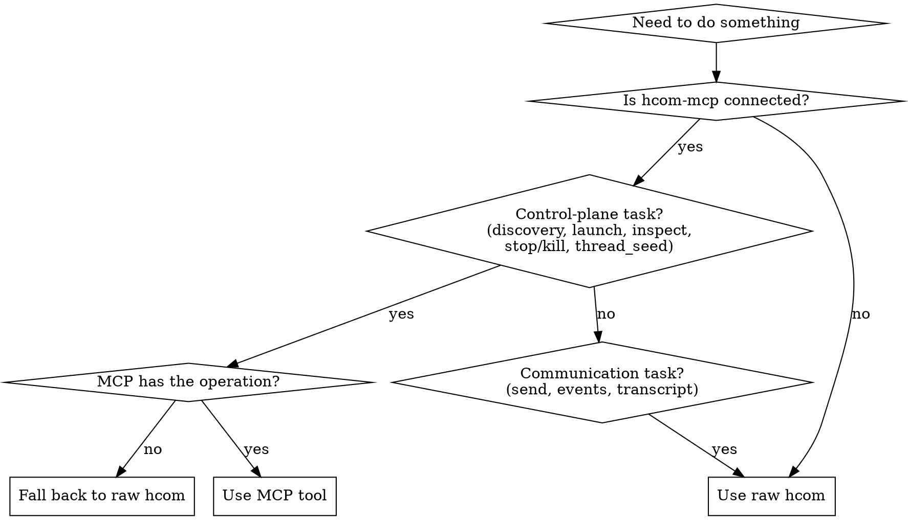

# hcom

## Overview

Use one visible hub and mostly headless workers. In OpenCode, the default hub is the current session. Do not launch another visible `hcom opencode` coordinator when the current session is already the hub. Workers may be `opencode`, `codex`, `claude`, or `gemini`, but they should usually run with `--headless` while the current session stays interactive.

Core principle: the hub owns the workflow, the thread is the source of truth, and workers only bypass the hub when the topology genuinely needs a peer handoff.

When `hcom-mcp` is available, use it for control-plane tasks such as discovery, launch, managed-fleet inspection, and cleanup. Keep raw `hcom` as the communication plane for `send`, thread seeding, peer handoff, and workflow reporting. Do not shell out to raw `hcom` for a control-plane task that already has an MCP equivalent.

**Default rule:** if prompted work might benefit from an agent, invoke this skill before deciding how to launch or coordinate one.

**Scope boundary:** This skill covers *interactive current-session coordination only*. If the user asks for a reusable script, workflow automation, `hcom run` script, or `#!/usr/bin/env bash` example, **stop and redirect them to `hcom-agent-messaging`** — do not write the script here. For installation or troubleshooting, also redirect to `hcom-agent-messaging`. For a full team topology or saved config, redirect to a planning skill such as `do-agents`.

## When to Use

- the user asks to spawn, launch, start, coordinate, or route agents or workers
- the user wants practical `hcom` operating guidance, not a full agent-team design
- the current session should remain the visible coordinator
- most workers should stay in the background
- workers may come from `opencode`, `codex`, `claude`, or `gemini`
- the user asks for a quick pattern, practical commands, or the right defaults
- workers may need to hand work directly to each other on the same thread
- you need explicit defaults for `--thread`, `--intent`, tags, and reporting
- `hcom-mcp` may be present and the agent needs a clear split between MCP bootstrap/control-plane tasks and raw `hcom` communication tasks

If the work might benefit from launching or coordinating an agent, load this skill first even when the user did not explicitly say `hcom`.

Do not use this skill for:

- `hcom` installation or troubleshooting
- reusable workflow scripts
- generating `agents/<slug>` artifacts

If the user explicitly asks for a reusable script, workflow automation, or `hcom run` script, do not write the script here. Hand that request off to `hcom-agent-messaging` and its script references.

## When `hcom-mcp` Is Available

Use MCP first for discovery, launch, and managed-fleet state. Use raw `hcom` once workers exist and the workflow is moving.



| Need | Preferred surface |
|---|---|
| discover saved launch options | `list_presets`, `list_topologies` |
| understand current state | `status`, `config_paths`, `list_all`, `list_managed` |
| inspect one managed agent | `inspect` |
| seed a workflow thread with exact hub mention auto-included | `thread_seed` |
| inspect thread messages | `thread_inspect` |
| launch or clean up managed workers | `launch`, `launch_topology`, `inspect`, `stop`, `kill`, `promote` |
| assign work, route peer handoffs, subsequent thread sends, watch message flow | raw `hcom send`, `hcom events`, `hcom transcript` |

Rules:

- if `hcom-mcp` is connected, you MUST use MCP for discovery and launch before using raw `hcom` spawn commands or `hcom --help` for launch discovery
- if `hcom-mcp` exposes the operation, do not use bash plus raw `hcom` for the same control-plane task; use the MCP tool instead
- if `hcom-mcp` is connected, use `thread_seed` instead of raw `hcom send` for thread creation — it auto-includes the exact `@<hub-name>` mention in the seed, and HTTP/unbound callers should pass `hub_name` explicitly
- do not read `~/.hcom/mcp/config.json`, `.hcom-mcp.json`, or hunt the repo just to discover presets or topologies when `hcom-mcp` is connected
- do not treat `hcom-mcp` as the message bus; it bootstraps and supervises, but workflow communication still lives on shared hcom threads
- if no exact topology matches, stay on the MCP path: use `list_presets`, then issue repeated `launch` calls with explicit preset and harness
- only fall back to raw `hcom` CLI for control-plane work when the MCP is unavailable, the user explicitly wants shell commands only, or the MCP lacks the operation you need

## Core Send Syntax

To send a message, put the recipients first as `@name` or `@tag-`, then any flags, then `--`, then the message text.

```bash
hcom send @name-or-tag- [--intent request|inform|ack] [--reply-to ID] [--thread THREAD] -- "message text"
```

Rules:

- Required: at least one `@recipient` and the `--` separator before message text.
- Usually required by house policy: `--intent request|inform|ack`.
- Optional: `--thread`, only for workflow scoping.
- Optional: `--reply-to`, only when responding to a specific message id.
- Direct messages are valid: omit `--thread` for a one-off direct send.
- Tagged routes use a trailing dash, e.g. `@eng-`; named agents use `@mona`.

Examples:

```bash
hcom send @mona --intent inform -- "Available for review."
hcom send @review- --thread "$WF_THREAD" --intent request -- "Review this on-thread."
```

`--thread` is optional command syntax; it is a workflow-scoping convention, not part of core delivery.

Shell quoting:

- Short plain text can go after `--` in quotes.
- For multiline Markdown or text containing backticks, `$variables`, brackets, nested quotes, or code blocks, prefer `--file` so the shell does not rewrite the message before `hcom` receives it.
- `--file` reads the message from a local file. Create the file using the current shell's normal temporary-file method; avoid it for secrets unless you control permissions and cleanup.
- If exact input modes matter, run `hcom send --help`.

Common mistakes:

- Do not put message text before `--`.
- Do not route to `@eng` when you mean the tag `@eng-`.
- Do not use `--thread` on launch commands.
- Do not omit `@recipients` unless you intentionally want broadcast behavior and understand thread membership.
- Do not rely on shell quoting for complex reviews or code snippets; use `--file`.

## House Defaults

| Decision | Default |
|---|---|
| Visible terminal | keep the current session headed |
| Spawned workers | `--headless --go` |
| Workflow isolation | for multi-step workflows, use one `WF_THREAD` per task |
| Stable routing | tags like `@eng-`, `@review-`, `@research-` |
| Final reporting | when using a workflow thread, report there so the hub sees it |
| Peer handoff | allowed only when the topology needs it |
| Assignment intent | `request` |
| Routine status intent | `inform`, not `ack` |
| Discovery and launch surface | prefer `hcom-mcp` tools when available |
| Messaging command | `hcom send` |
| Waiting for worker replies | end your turn and let incoming hcom messages arrive naturally |
| Tag syntax | launch with `--tag eng`, route with `@eng-` |
| Message syntax | recipients first as `@name` or `@tag-`; flags before `--`; message text after `--` |
| Spawn threading | never pass `--thread` to launch commands |
| Hub routing | seed with `@<hub-name>` so hub is thread member; workers `@<hub-name>` on important replies |
| System prompt in presets | opencode: merged into `--hcom-prompt` as `[System Role]` prefix; claude/codex: passed as `--hcom-system-prompt` |

Intent rule:

- never send `--intent ack` in reply to an `inform` message
- for an informational message, either send no reply or send a separate `inform` only if a useful status or availability update helps the workflow
- reserve `ack` for explicit acknowledgments tied to a `request` or a reply context that actually needs confirmation

## Quick Start

Recommended order when `hcom-mcp` is connected:

1. Use `status` to orient the current workspace.
2. Use `list_presets` or `list_topologies` to discover what can be launched.
3. If a topology fits, use `launch_topology`. Otherwise use repeated `launch` calls with explicit preset and harness.
4. For multi-agent workflows, seed one workflow thread with `thread_seed` and run the collaboration there. In the HTTP/unbound MCP path, pass `hub_name` explicitly.
5. If the workers were told to report back on-thread, end your turn and wait for incoming hcom messages naturally.

## Waiting For Worker Replies

After you launch workers and seed the shared thread, end your turn and let hcom messages arrive naturally. Do not use `hcom listen` or poll `hcom events --last` in a loop.

For worked examples of MCP-first launch flow and bad/good waiting patterns, see `references/examples.md`.

`$HUB_NAME` is the hub's own CVCV name (4 letters, e.g. `muho`). It is available from the hcom system context (`Your name: muho`) or from `hcom list`. Use the real name, not a tag — there is no `hub` tag unless you explicitly launched with `--tag hub`.

### How Threads Work

- A thread is a **name** for a conversation namespace, not a fixed membership group — @mentions on each individual message determine delivery, not the seed
- **The sender is never included in `delivered_to`** — if the hub creates a thread by sending `@eng- @review-`, the hub is NOT a thread member and will NOT receive thread messages
- To make the hub a thread member, include `@<hub-name>` in the seed @mentions; when `hcom-mcp` is connected, prefer `thread_seed` over raw `hcom send` for thread creation (pass `hub_name` explicitly in the HTTP/unbound path)

For common mistakes, rationalization counters, and red flags, see `references/discipline.md`.

## Cross-Tool Launch Patterns

Use this section only when `hcom-mcp` is unavailable, the user explicitly wants shell-only launch commands, or the MCP lacks the operation you need.

```bash
hcom 1 opencode --tag exec --go --headless
hcom 1 codex --tag eng --go --headless
hcom 1 claude --tag review --go --headless
hcom 1 gemini --tag research --go --headless
```

For OpenCode worker model selection, prefer provider-qualified IDs:

```bash
HCOM_OPENCODE_ARGS="--model openai/gpt-5.4" hcom 1 opencode --tag exec --go --headless
```

## Worker Prompt Contract

When you tell a worker what to do, include these defaults:

- for threaded workflow assignments, stay on the assigned thread
- keep updates minimal
- use `request` for assignments, handoffs that need action, and blockers that need a decision
- use `inform` for status and final outcomes
- reserve `ack` for explicit acknowledgments tied to a request or reply context
- when a workflow thread exists, report blockers and final outcomes on-thread, @mentioning the hub (`@<hub-name>`) on important replies
- hand work directly to another tagged role only when the topology requires it
- stop when the assignment is complete if the task is one-shot

Bad and good intent example:

```bash
# Bad: acking an informational message
hcom send @zore --intent ack --reply-to 19354 -- "Acknowledged. I will stay available and report important updates to @zore."

# Good: no reply at all when the inform needs no acknowledgment

# Good: separate informational follow-up when a status update is actually useful
hcom send @zore --intent inform -- "Available. I will report important updates here."
```

For common mistakes, rationalization counters, and red flags, see `references/discipline.md`.

## If The User Needs More

- use `hcom-agent-messaging` for installation, troubleshooting, or script details
- use a dedicated planning skill such as `do-agents` when the user wants a topology decision, agent roster, or saved config
- run `hcom --help`, `hcom send --help`, or `hcom opencode --help` when exact flag syntax matters

## Hard Boundaries

- do not write reusable `hcom` scripts in this skill
- do not answer script-authoring requests with `#!/usr/bin/env bash` or `hcom run` examples here
- for script requests, point to `hcom-agent-messaging` and its script template/reference material instead

If the user asks for a reusable script, workflow automation, or `hcom run` script, respond with a short redirect:

> That is reusable workflow-script scope, not current-session coordination scope. Use **hcom-agent-messaging** for script authoring and the hcom script template/reference docs.
